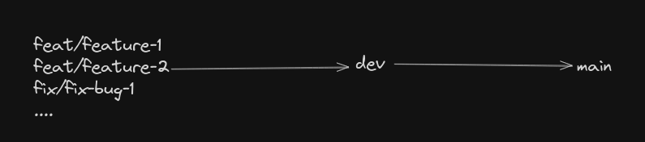

# Monorise

Simplify Single table design with DynamoDB

## 🚀 Features
- Use DynamoDB as a Graph DB
- Access data through simple API calls
- Relationships management between entities
- No more writing complex DynamoDB queries

## Core Concepts

- Entity
- Mutual
- Tag
  
Learn more about these concepts in our [Concepts Guide](docs/CONCEPT.MD).

## 📦 Installation

### Using npm / yarn / etc.
```bash
npm install @monorise/core @monorise/cli @monorise/react @monorise/base
```

### Or clone the repo
```bash
git clone https://github.com/monorist/monorise.git
cd monorise
npm install
```

## 🛠️ Usage

### Basic Example
```js
import { yourFunction } from 'your-package-name'

yourFunction('example')
```

### CLI Example (if applicable)
```bash
npx @monorise/cli
```

## 📄 Documentation

Link to full docs (in repo or external site):  
[👉 View the Docs](https://your-docs-url.com)

Or briefly explain the core API in the README itself if it’s small.

## 🤝 Contributing

We welcome contributions!  
Check out our [contributing guide](CONTRIBUTING.md) and [code of conduct](CODE_OF_CONDUCT.md).

```bash
git checkout -b your-feature
git commit -m 'add amazing feature'
git push origin your-feature
```

## 📂 Folder Structure

```bash
.
├── src/            # Main source code
├── tests/          # Unit and integration tests
├── examples/       # Example usage
└── README.md
```

## ✅ Roadmap

- [x] Core DynamoDB Data Layer
- [x] React data access
- [x] CLI Generator
- [ ] Test cases
- [ ] Component for SST/Pulumi for simpler setup

## 🧪 Running Tests
```bash
npm run test
```

## 🧰 Built With

- [Node.js](https://nodejs.org/)
- [Your Framework](https://example.com/)
- Other dependencies...

## Gitflow (How to develop)



### Main branch

1. When `dev` is ready
1. Branch out from `dev` branch
1. Run `npm run changeset:dev-exit` to end dev mode
1. Create prerelease end PR to `main`
1. Review and merge
1. Stable version published

### Dev branch

1. Run `npm run changeset:dev-start` to start dev mode
1. Your PR merged into dev
1. Changesets bump version PR created / updated (when added new features/fixes)
1. Repeat 2-3 to keep adding new features/fixes
1. Changesets PR (step 2) merged
1. Publish as 0.X.X-dev.x

### Feature branch

1. Run `npm run changeset` to record summary of your changes
1. When ready for review, create a PR and point to `dev` branch


## 📝 License

Distributed under the MIT License.  
See [`LICENSE`](./LICENSE) for more information.

## 🌟 Acknowledgments

- Inspiration, references, or shout-outs
